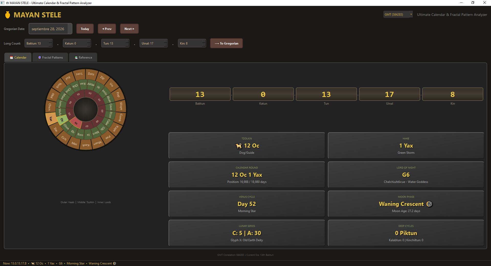

# Mayan Stele - Ultimate Calendar & Fractal Pattern Analyzer

A comprehensive, visually stunning Mayan calendar application built with Python and PySide6. Convert any Gregorian date to its Mayan equivalent, track deep cosmic eras, and discover personal fractal patterns within the ancient cycles using an advanced astronomical engine.




## Features

### Advanced Calendar Systems
- **Long Count (With Deep Time)** - Tracks standard cycles (Baktun to Kin) plus deep-time macro eras (Piktun, Kalabtun, Kinchiltun, and Alautun up to 23 billion days). Includes animated odometer display and **Reverse Long Count** conversion!
- **Tzolkin** - 260-day sacred calendar with day sign meanings and 13 Galactic Tones.
- **Haab'** - 365-day civil calendar with month meanings.
- **Calendar Round** - 52-year cycle position tracker.
- **Lords of the Night** - 9-day underworld deity cycle (G1-G9).
- **Venus Cycle** - 584-day synodic period tracking phases from the Dresden Codex (Morning Star, Evening Star, Conjunctions).
- **Lunar Supplementary Series** - Precision lunar mathematics computing Glyph C (Lunation 1-6), Glyph A (29/30 days), and Glyph X (Patron Deities of the Moon).
- **819-Day Cycle** - K'awiil deity rotation and directional colors.

### Fractal Pattern Analyzer
- **Algorithmic Search (LCM/CRT)** - Powered by advanced mathematical models (Least Common Multiple and Chinese Remainder Theorem) to instantly find exact cycle alignments thousands of years into the future.
- **Harmonic Nodes Detection** - Scores alignments not just on full returns (Day 0), but also Oppositions (50%), Squares (25%/75%), and the Golden Ratio (Phi - 61.8%).
- **Natal Resonance Mode** - Input your birth date to shift the "Zero Point" of the universe to your personal galactic signature. Instantly calculate your future Tzolkin Returns, Venus Returns, and geometric life milestones.
- **Interactive Timeline** - Visual timeline and table with convergence markers spanning custom date ranges.

### Stunning Visuals & Encyclopedia
- **Circular Calendar Wheel** - Animated rotating rings for Haab, Tzolkin, and Lords with text labels embedded in the stone.
- **Status Bar Live Clock** - A real-time ticking clock showing current Mayan energies.
- **Reference Encyclopedia** - Built-in academic glossary covering 13 Tones, Lunar Patrons, Venus Phases, Deep Time eras, and Historical Correlations.

## Installation

```bash
# Clone the repository
git clone https://github.com/plantacerium/MayanCalendar.git
cd MayanCalendar

# Install dependencies
pip install PySide6

# Run the application
python mayan-stele.py
```

## Advanced Astronomy & Mechanics

### Deep Time Eras
The Long Count is fundamentally a linear count of days since the Mayan creation date. This application calculates up to the largest known Mayan eras:

| Unit | Days | Equivalent |
|------|------|-------------|
| Kin | 1 | 1 day |
| Uinal | 20 | 20 days |
| Tun | 360 | ~1 year |
| Katun | 7,200 | ~20 years |
| Baktun | 144,000 | ~394 years |
| Piktun | 2,880,000 | ~7,885 years |
| Kalabtun | 57,600,000 | ~157,700 years |
| Kinchiltun | 1,152,000,000 | ~3.15 million years |
| Alautun | 23,040,000,000 | ~63 million years |

### Multiple Correlations
Switch instantly between historical models linking Mayan time to the Gregorian calendar:
- **GMT (584283)** - Standard archaeological consensus (Goodman-Martinez-Thompson).
- **GMT+2 (584285)** - Adjusted astronomical correlation aligning with eclipse data.
- **Spinden (489384)** - Early 1920s correlation (13.0.0.0.0 = 3373 BCE).

## Personal Natal Resonance

The Fractal Pattern Analyzer allows you to sync the cosmic clock to your birth date. 
1. Go to the **Fractal Patterns** tab.
2. Select your `Start Date` and `End Date`.
3. Check `Enable` under **Natal Resonance** and input your Birth Date.
4. Click "Find Convergences" to calculate precise future moments when the current cosmic cycles structurally harmonize with your birth energies (e.g., your Tzolkin or Venus return).

## Historical Dates

Test the converter with these significant dates:

| Gregorian | Long Count | Tzolkin | Haab' | Event |
|-----------|------------|---------|-------|-------|
| Aug 11, 3114 BCE | 0.0.0.0.0 | 4 Ahau | 8 Cumku | Creation |
| Dec 21, 2012 | 13.0.0.0.0 | 4 Ahau | 3 Kankin | 13th Baktun |

## Technical Details

- **Framework**: PySide6 (Qt for Python)
- **Style**: Custom CSS with Fusion theme for a stone-carved, ancient aesthetic
- **Animations**: Smooth Qt property animations, QEasingCurve
- **Algorithms**: GCD/LCM modular math, harmonic fractal weighting

---

*"Time is not a line, but a spiral of cycles within cycles."*
